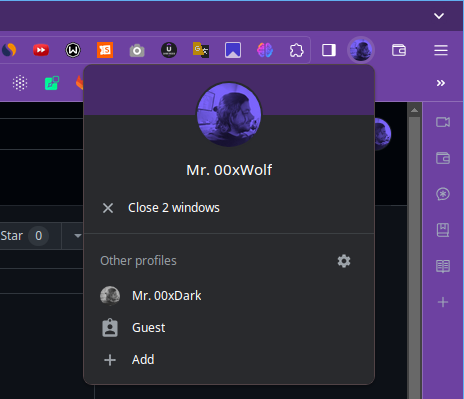
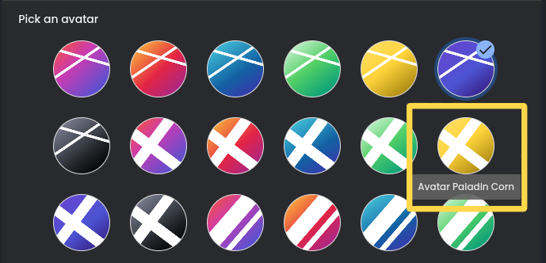
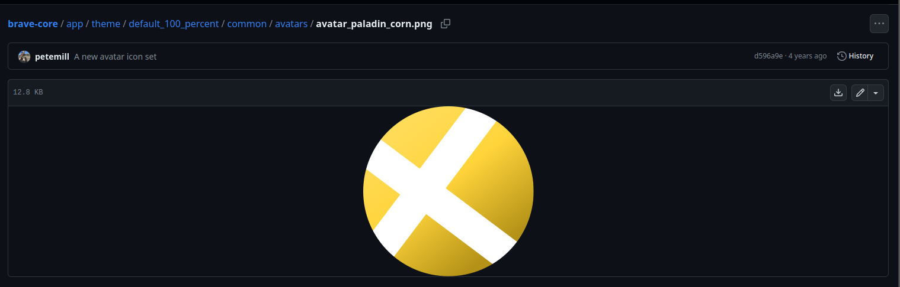
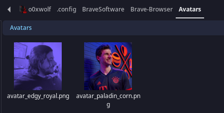
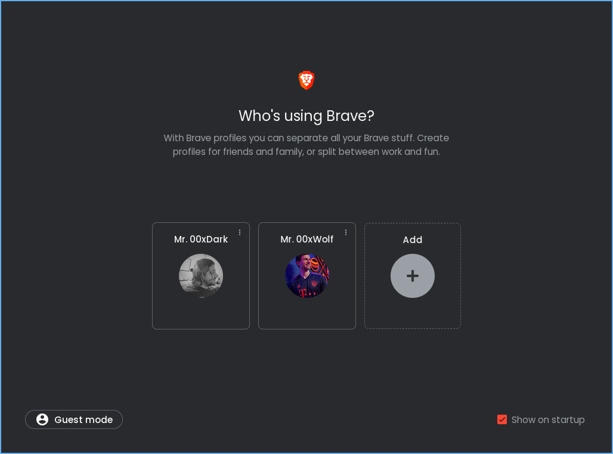
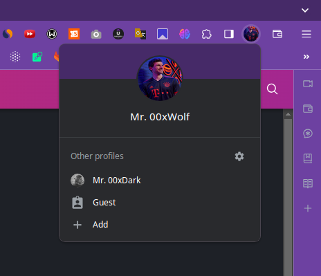
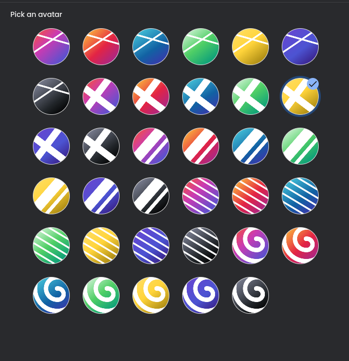
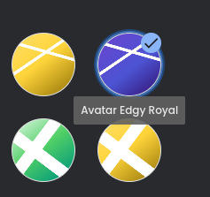
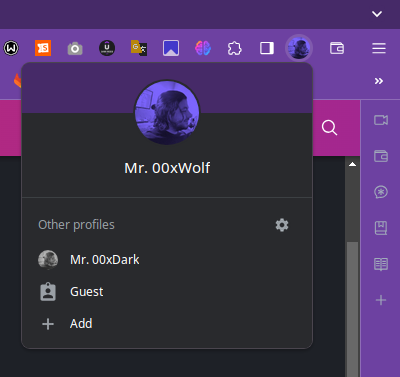
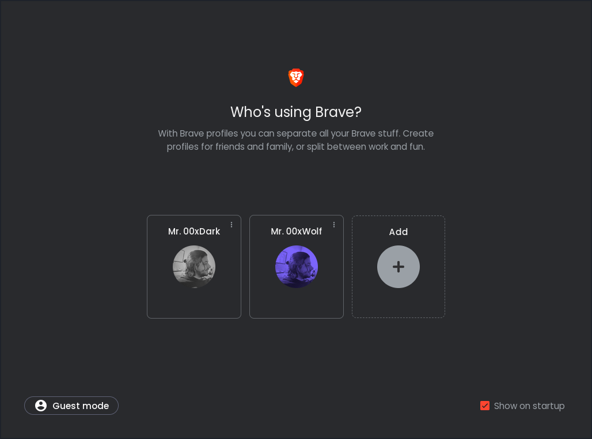

# Tips For Changing Brave Avatar

guide for changing avatar profile picture in the Brave browser

> **_NOTE:_** 
> 
> **The profile icon will not appear when you only have 1 profile, create a new Profile to show up.**

---

- go to [`Settings -> Profile name and icon`](brave://settings/manageProfile)
- in the `Pick an avatar` section, select an avatar and see it's name
- e.g: `Avatar Paladin Corn`
  - 
- find the avatar from this list: [Avatars](https://github.com/brave/brave-core/tree/master/app/theme/default_100_percent/common/avatars)
  - the name is: `avatar_paladin_corn.png`
  - 
- go to the `config` directory for Brave Browser
  - in **Linux**: `~/.config/BraveSoftware/Brave-Browser`
  - in **MAC OS**: `~/Library/Application Support/BraveSoftware/Brave-Browser`
  - in **Windows**: `%LOCALAPPDATA%\BraveSoftware\Brave-Browser\User Data\`
- then, create `Avatars` directory if it doesn't exist
- then, pick an image and save it in the `Avatars` directory with the name of the selected avatar in the above step(`avatar_paladin_corn`).
  - save the image in `.png` format.
  - 
- restart the Browser.

---

If you go to [`Settings -> Profile name and icon`](brave://settings/manageProfile) again, you will find that the image won't be updated, but when you select the appropriate one(that you replaced in  the `Avatars` directory) it will show up.

I'm gonna select this avatar again, that I got replaced

it will show up your avatar

restart the Browser. 

