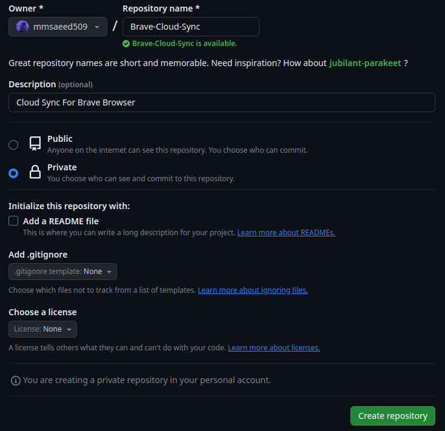

# Tips For Sync All Data For Brave Browser

The idea here is that we're gonna:

- create a backup Repo on GitHub.
- create a cron job to push the new changes to the Repo.

---

### 1st create a private repo on GitHub

- Create a Repo with the name `Brave-Cloud-Sync` or any name you want

  - 

- go to the `config` directory for Brave Browser
  
  - in **Linux**: `~/.config/BraveSoftware/Brave-Browser`
  - in **MAC OS**: `~/Library/Application Support/BraveSoftware/Brave-Browser`
  - in **Windows**: `%LOCALAPPDATA%\BraveSoftware\Brave-Browser\User Data\`

- Create a Git Repo and Push to the GitHub Repo
  
  - open terminal here: `git init`
  - add Remote to GitHub Repo: `git remote add origin https://github.com/mmsaeed509/Brave-Cloud-Sync.git`
    - 
  - then add [**`push.sh`**](./push.sh) script to use it to push to GitHub Repo
  - then push to GitHub Repo `./push.sh`