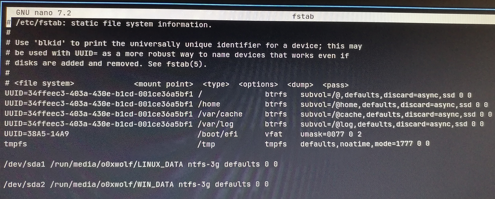

# ReInstall GRUB using `Arch-Chroot` on `btrfs`

- mount the `btrfs` `sub-volumes`

  - You can find out the `sub-volumes` from `/etc/fstab`
  - 

```bash
sudo mount -o subvol=@ /dev/nvme0n1p1 /mnt

sudo mount -o subvol=@home /dev/nvme0n1p1 /mnt/home

sudo mount -o subvol=@cache /dev/nvme0n1p1 /mnt/var/cache
```

- mount EFI partition

```bash
sudo mount /dev/nvme0n1p2 /mnt/boot/efi
```
- chroot to Exodia OS

```bash
sudo arch-chroot /mnt
```

- reinstall GRUB

```bash
grub-install --target=x86_64-efi --efi-directory=/boot/efi --bootloader-id=ExodiaOS

grub-mkconfig -o /boot/grub/grub.cfg
```